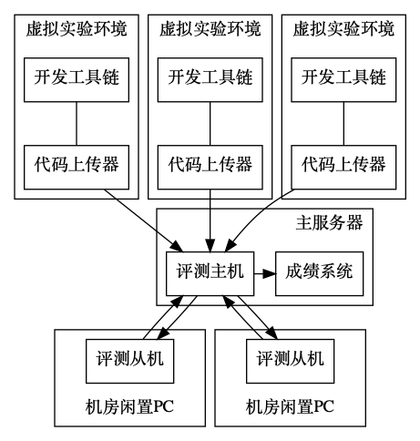
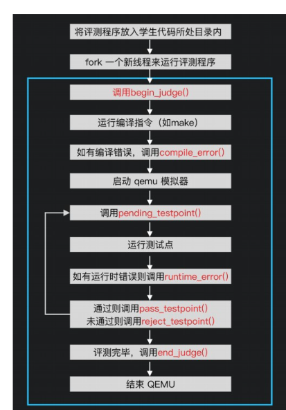

# 基于分布式评测技术的操作系统实验平台
## 简介
本实验平台是一款简单便捷的操作系统课程实验平台。

按照功能主要分为四个部分，**实验代码上传器、实验平台评测机、实验平台主机、实验平台前端**。另外，还有相对应的实验题目、实验报告等内容。

本平台是一种新型分布式操作系统实验教学平台，它汲取众多方案所长，并且针对其优缺点加以改良，扬长避短，运用分布式技术解决了评测占用资源多、实验占用服务器资源多、学生上手门槛高等教学开展过程中所遇到的难题。能够切实满足全国普通高校的教学需要。

具体功能分为学生端和教师端来简单介绍：

学生端：

1、学生只需安装已经配置好的虚拟机镜像就可以编写、调试代码，通过内置实验代码上传器上传实验作业，上传器对其中临时文件进行过滤再进行打包上传至实验平台主机；

2、实验平台主机接收用户的评测请求，调度分布式实验平台评测集群（评测机）；

3、实验平台评测机向主机拉取待评测代码，并根据已通过的测试点权重给出相应分数完成评测后将评测结果返回平台主机；

4、实验平台主机汇总评测结果，统计评测成绩，通过HTTP协议进行JSON RPC通讯，将结果传输到实验平台前端；

5、实验平台前端展示实验成绩和代码评测情况。

教师端：

1、通过实验平台主机教师可以测试实验，添加实验，上传实验评测程序，增加测试点；

2、通过实验平台前端查看学生成绩，查看评测任务队列，下载成绩单等。

| 了解更多 | 文档 | 代码/视频 |
| :----: | :----: | :----:|
| 实验平台 | [作品设计报告.pdf](./Documentation/Experimental%20Platform%20Design%20Document/%E4%BD%9C%E5%93%81%E8%AE%BE%E8%AE%A1%E6%8A%A5%E5%91%8A.pdf)    [实验平台简介.pdf](./Documentation/Experimental%20Platform%20Design%20Document/%E6%96%87%E6%A1%A3_%E5%AE%9E%E9%AA%8C%E5%B9%B3%E5%8F%B0%E7%AE%80%E4%BB%8B.pdf)| [演示视频](./Documentation/%E6%BC%94%E7%A4%BA%E8%A7%86%E9%A2%91.mp4.zip) |
| 实验代码上传器 |[代码上传器.pdf](./Documentation/Experimental%20Platform%20Design%20Document/%E4%BB%A3%E7%A0%81%E4%B8%8A%E4%BC%A0%E5%99%A8.pdf)|[上传器代码-uploader](./platform-code/uploader/)|
|实验平台评测机|[实验平台后端-评测机.pdf](./Documentation/Experimental%20Platform%20Design%20Document/%E5%AE%9E%E9%AA%8C%E5%B9%B3%E5%8F%B0%E5%90%8E%E7%AB%AF-%E8%AF%84%E6%B5%8B%E6%9C%BA.pdf)|[评测机代码-worker](./platform-code/worker/)|
| 实验平台主机 |[实验平台后端-主机.pdf](./Documentation/Experimental%20Platform%20Design%20Document/%E5%AE%9E%E9%AA%8C%E5%B9%B3%E5%8F%B0%E5%90%8E%E7%AB%AF-%E4%B8%BB%E6%9C%BA.pdf)|[平台主机代码-host](./platform-code/host/)|
| 实验平台前端 |[实验平台前端.pdf](./Documentation/Experimental%20Platform%20Design%20Document/%E5%AE%9E%E9%AA%8C%E5%B9%B3%E5%8F%B0%E5%89%8D%E7%AB%AF.pdf)|[前端代码-frontend](./platform-code/frontend/)|
|其他|[实验报告文档](./Documentation/Experimental%20topic%20guide%20book/)  [评测程序对接成绩系统.pdf](./Documentation/Experimental%20Platform%20Design%20Document/%E8%AF%84%E6%B5%8B%E7%A8%8B%E5%BA%8F%E5%AF%B9%E6%8E%A5%E6%88%90%E7%BB%A9%E7%B3%BB%E7%BB%9F%EF%BC%88%E4%B8%BB%E6%9C%BA%EF%BC%89.pdf)| \ |

## 架构图

## 特点
1、由于实验平台需要同时满足上百同学的使用，而提高服务器条件开销太大，因此特采用分布式评测技术，评测端工作机可以被灵活地部署在多台计算机上，从而达到在服务器设备资源有限的情况下，灵活而又有效地满足高并发场景下评测需求。本操作系统实验平台的评测端可以在 300 名学生同时提交评测任务时稳定运行；

2、让学生基于真正的操作系统内核代码进行实验，而不是传统的模拟实验；

3、为学生提供编写和调试代码的环境，相对熟知的MIT实验系统节省了学生搭建环境的时间成本，避免搭建环境造成的课程进度阻碍，降低学生实验初期准备工作的难度，使学生更好上手，更加具有实用性。

## 使用说明
### 方法一：连接远程服务器进行使用（推荐）

1、下载虚拟机包，下载地址：https://void.cowtransfer.com/s/5a8896626cce43

2、在虚拟机软件插入虚拟机（VMware）

### 方法二：本地部署（比较复杂，不推荐）
..................链接到第四个模块代码的readme .......................

## 基本原理

### 评测功能原理
评测主机采用 SpringBoot 框架进行开发，Java 作为开发语言，MySQL 作为数据库。评测采用 QEMU 作为模拟器，GNU 工具链作为编译环境，Linux 系统（CentOS、Ubuntu 等）作为宿主机来运行评测环境，Python 或 Bash 等脚本语言来编写评测程序。评测机程序以微服务的形式存在，可以被灵活地部署在任何装有 JDK 的宿主机或者容器中。评测机将评测结果通过 kafka 消息队列送回至成绩系统，并持久化存储至MySQl数据库中。

### 上传功能原理
学生可以通过 SSH 或 Telnet 来远程连接服务器，通过 SFTP 上传自己编写的代码也可以用自己的电脑上通过 VSCode 等代码编辑器来编写代码，然后利用 VSCode Remote 功能 来连接服务器进行远程代码编译和调试，这样可以省去学生学习使用 SSH 和 SFTP 的学习成本。

### 平台前端原理
Web 前端负责界面渲染，将后端传来的成绩信息和实验信息等渲染成 Web 界面，以向学生展示相关的信息。采用 Vue.js 框架进行开发，采用 JavaScript、 HTML、 CSS 作为开发语言。前后端通过 Restful HTTP API 进行通信，前后端分离开发，并共同部署在服务器中。

## 演示视频

https://github.com/fight-code/reposname/issues/1#issue-1248066015

https://user-images.githubusercontent.com/53158212/170262424-3c211746-a2bf-440e-973a-5e33e4386a60.mp4
