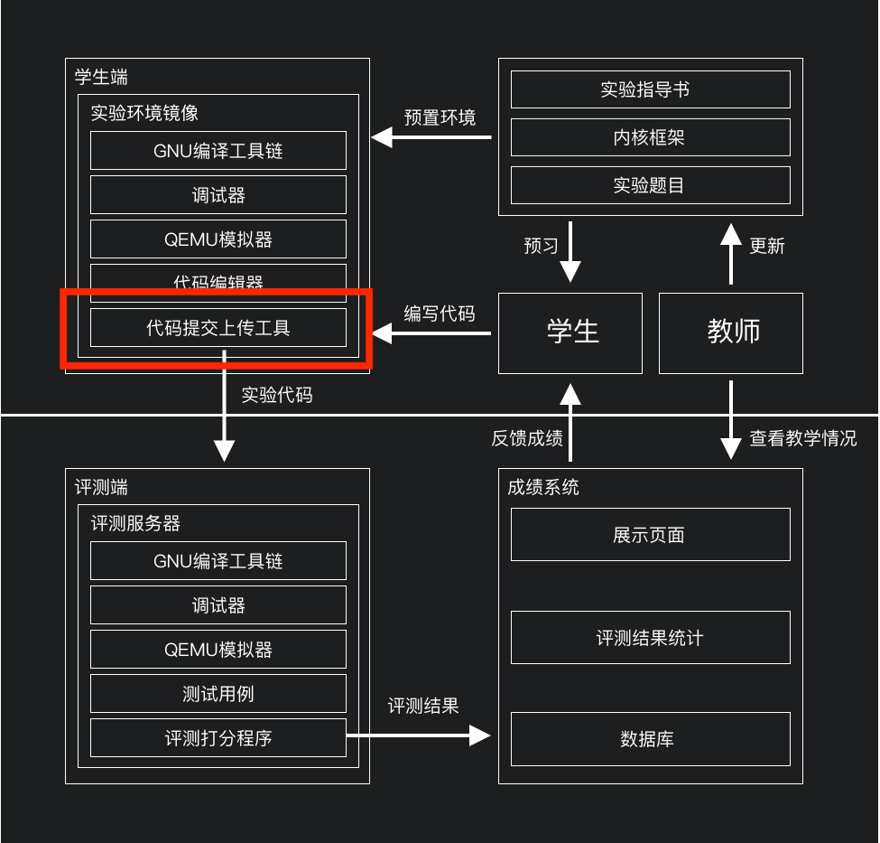

# 代码上传器
## 功能简介
北方工大操作系统实验平台用户代码上传器，用于将学生编写的实验代码打包并上传至服务器，学生做完实验后，只需单击上传按钮即可完成代码提交工作。上传器在打包前会对代码临时文件进行过滤，以减轻服务器的带宽负担。


## 配置文件字段定义
``` json
{
    //主服务器地址
    "server": "http://127.0.0.1:2333",
    //要上传的实验的序号
    "expId": 8,
    //实验名称
    "expName": "进程调度",
    //排除文件，类似.gitignore，用来筛选掉不需要上传的临时文件
    //支持通配符
    "exclude": [
        "*~",
        "_*",
        "*.o",
        "*.d",
        "*.asm",
        "*.sym",
        "*.img",
    ],
    //当前用户的token，不需要填写，登录后上传器会自动填写
    "token": "1705d600-3163-4707-8348-aae0679e6142"
}
```
## 构建方式
构建前需安装node.js环境，并安装electron和electron-forge包。
``` bash
# 在根目录
npm install
npm run build
cd ./electron
electron-forge make --platform linux
```


